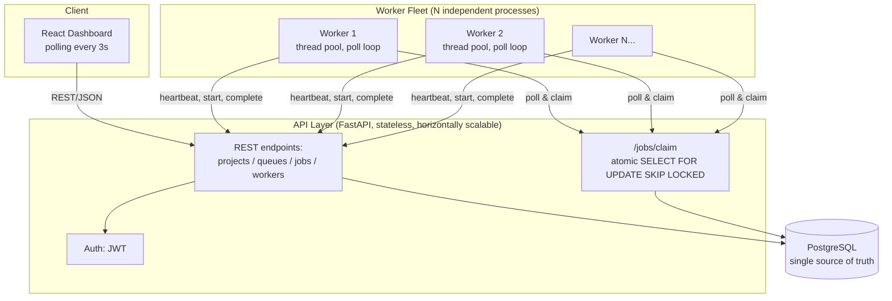

# System Architecture

## Overview

## Why this shape

**PostgreSQL as the coordination point, not a separate broker.** Given the
timeline and the requirement for strict relational modeling (Section:
Database Design), Postgres does double duty as both system-of-record and
job queue. `FOR UPDATE SKIP LOCKED` gives the same atomic-claim guarantee
a dedicated broker (SQS, RabbitMQ) would, without adding an operational
dependency. This is a documented trade-off — see `design_decisions.md`.

**Stateless API, stateful workers.** The FastAPI layer holds no in-memory
job state, so it can be scaled behind a load balancer trivially. Workers
hold ephemeral state only (their thread pool, in-flight job set) — if a
worker dies mid-job, the job simply never gets a `complete` call, and a
future addition (heartbeat-based reclaim job) would requeue it. That
reclaim sweep is flagged as a next step, not yet wired into `main.py`.

**Polling over push, for now.** Both the worker's queue polling and the
dashboard's live updates use polling rather than WebSockets/pub-sub. This
was a deliberate scope cut to protect the core reliability requirements
(atomic claim, retries, DLQ) under the one-day timeline. WebSocket support
is listed as a bonus feature and the swap-in point is isolated: only
`poll_loop()` in `worker.py` and the `useEffect` polling interval in
`index.html` would need to change.

## Request flow: submitting and running a job

1. Client calls `POST /jobs` with queue id, job type, payload, optional
   `run_at` (delayed) or `cron_expression` (recurring).
2. Job lands in Postgres with `status='queued'` (or `'scheduled'` if
   `run_at` is in the future).
3. A worker's poll loop calls `POST /jobs/claim`. The claim query selects
   eligible rows ordered by priority, locks them with `SKIP LOCKED` so
   concurrent claimers never block on or double-claim the same row, and
   flips them to `status='claimed'` in a single atomic UPDATE.
4. Worker calls `/jobs/{id}/start`, executes the job's handler in its
   thread pool (bounded by `MAX_CONCURRENT_JOBS`), then calls
   `/jobs/{id}/complete` with the outcome.
5. On failure: if `attempt_count < max_attempts`, job returns to
   `queued` for retry (with backoff, per the queue's retry policy);
   otherwise it moves to `dead_letter` and a `dead_letter_queue` row
   is written with the failure reason.

## Scaling considerations

- **Horizontal worker scaling:** each worker is a fully independent
  process with no coordination beyond the shared database, so scaling
  out is just starting more `worker.py` processes (or containers).
- **Index design for claim throughput:** `idx_jobs_claimable` is a
  partial index scoped to `status IN ('queued','scheduled')`, so the
  claim query stays fast regardless of how many millions of completed
  jobs accumulate in the table over time.
- **Queue-level concurrency limits:** `queues.concurrency_limit` is
  modeled in the schema so a future version can cap in-flight jobs per
  queue (not just per worker) — the column is enforced at the worker's
  claim-request level (`limit` param) as a straightforward next step.
