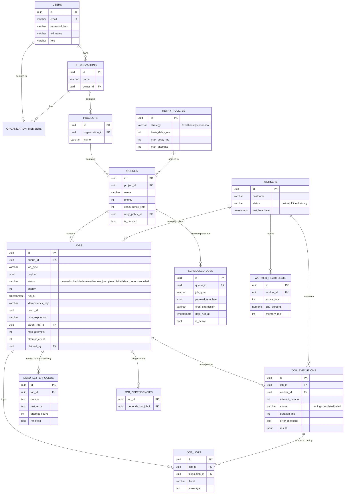

# ER Diagram

```mermaid
erDiagram
    USERS ||--o{ ORGANIZATIONS : owns
    USERS ||--o{ ORGANIZATION_MEMBERS : "belongs to"
    ORGANIZATIONS ||--o{ ORGANIZATION_MEMBERS : has
    ORGANIZATIONS ||--o{ PROJECTS : contains
    PROJECTS ||--o{ QUEUES : contains
    RETRY_POLICIES ||--o{ QUEUES : "applied to"
    QUEUES ||--o{ JOBS : contains
    QUEUES ||--o{ SCHEDULED_JOBS : "cron templates for"
    JOBS ||--o{ JOB_EXECUTIONS : "attempted as"
    JOBS ||--o{ JOB_LOGS : logs
    JOBS ||--o{ DEAD_LETTER_QUEUE : "moved to (if exhausted)"
    JOBS ||--o{ JOB_DEPENDENCIES : "depends on"
    WORKERS ||--o{ JOB_EXECUTIONS : executes
    WORKERS ||--o{ WORKER_HEARTBEATS : reports
    WORKERS ||--o{ JOBS : "currently claims"
    JOB_EXECUTIONS ||--o{ JOB_LOGS : "produced during"

    USERS {
        uuid id PK
        varchar email UK
        varchar password_hash
        varchar full_name
        varchar role
    }
    ORGANIZATIONS {
        uuid id PK
        varchar name
        uuid owner_id FK
    }
    PROJECTS {
        uuid id PK
        uuid organization_id FK
        varchar name
    }
    RETRY_POLICIES {
        uuid id PK
        varchar strategy "fixed|linear|exponential"
        int base_delay_ms
        int max_delay_ms
        int max_attempts
    }
    QUEUES {
        uuid id PK
        uuid project_id FK
        varchar name
        int priority
        int concurrency_limit
        uuid retry_policy_id FK
        bool is_paused
    }
    JOBS {
        uuid id PK
        uuid queue_id FK
        varchar job_type
        jsonb payload
        varchar status "queued|scheduled|claimed|running|completed|failed|dead_letter|cancelled"
        int priority
        timestamptz run_at
        varchar idempotency_key
        uuid batch_id
        varchar cron_expression
        uuid parent_job_id FK
        int max_attempts
        int attempt_count
        uuid claimed_by FK
    }
    JOB_DEPENDENCIES {
        uuid job_id FK
        uuid depends_on_job_id FK
    }
    WORKERS {
        uuid id PK
        varchar hostname
        varchar status "online|offline|draining"
        timestamptz last_heartbeat
    }
    WORKER_HEARTBEATS {
        uuid id PK
        uuid worker_id FK
        int active_jobs
        numeric cpu_percent
        int memory_mb
    }
    JOB_EXECUTIONS {
        uuid id PK
        uuid job_id FK
        uuid worker_id FK
        int attempt_number
        varchar status "running|completed|failed"
        int duration_ms
        text error_message
        jsonb result
    }
    JOB_LOGS {
        uuid id PK
        uuid job_id FK
        uuid execution_id FK
        varchar level
        text message
    }
    SCHEDULED_JOBS {
        uuid id PK
        uuid queue_id FK
        varchar job_type
        jsonb payload_template
        varchar cron_expression
        timestamptz next_run_at
        bool is_active
    }
    DEAD_LETTER_QUEUE {
        uuid id PK
        uuid job_id FK
        text reason
        text last_error
        int attempt_count
        bool resolved
    }
```

See `db/schema.sql` for full column definitions, constraints, and index
rationale (commented inline at the bottom of the file).
